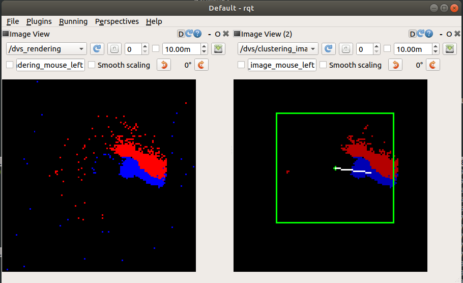

# eDVS转速测量

## 简介说明

该代码基于Ubuntu18.04 ROS（melodic）下开发的算法包，同时也适用于Ubuntu16.04 ROS(kinect)。包含eDVS驱动包（edvs_ros_simple，基于libcaer的eDVS驱动程序）、渲染器（dvs_renderer，该包来源于[rpg_dvs_ros](https://github.com/uzh-rpg/rpg_dvs_ros)）、转速测量包（clustering）。

---

## 安装说明

1. 安装libcaer依赖

   **依赖要求：**

   - pkg配置
   - cmake> = 2.6
   - gcc> = 4.9或clang> = 3.6
   - libusb> = 1.0.17
   - 可选：libserialport> = 0.1.1
   - 可选：OpenCV> = 3.1.0

   而libserialport通过apt-get只能安装到0.1.0版本，要获得最新的0.1.1版本则需要从源码安装。 

   ~~~shell
   $ sudo apt-get install build-essential cmake pkg-config libusb-1.0-0-dev
   $ git clone https://github.com/martinling/libserialport.git
   $ cd ~/libserialport
   $ sudo apt-get install dh-autoreconf
   $ ./autogen.sh
   $ ./configure
   $ sudo make install
   ~~~

2. 安装libcaer库

   libcaer是事件相机C++驱动库，可支持设备有DVS128、eDVS、Davis。

      ~~~shell
   $ git clone https://github.com/inivation/libcaer.git
   $ cd ~/libcaer
   $ mkdir build
   $ cd build
   $ cmake -DCMAKE_INSTALL_PREFIX=/usr -DENABLE_SERIALDEV=1 -DENABLE_OPENCV=1 ..
   $ make
   $ sudo make install
      ~~~

      在此应该添加对libcaer的支持串口规则：

   ~~~shell
   $ cd /etc/udev/rules.d
   $ sudo gedit 65-inivation.rules 
   ~~~
   
   在 65-inivation.rules文件中添加以下代码
   
   ~~~shell
   # All DVS/DAVIS/Dynap-SE systems
   SUBSYSTEM=="usb", ATTR{idVendor}=="152a", ATTR{idProduct}=="84[0-1]?", MODE="0666"
   # eDVS 4337
   SUBSYSTEM=="usb", ATTR{idVendor}=="0403", ATTR{idProduct}=="6014", MODE="0666"
   ~~~
   
   保存后，重新加载udev规则
   
   ```shell
   $ sudo udevadm control --reload-rules
   $ sudo udevadm trigger
   ```
   
   此时可应用libcaer/example中eDVS例子进行读取。若需要串口权限，通过修改udev规则即可。
   
   编辑文件:
   
   ```shell
   $ sudo gedit /etc/udev/rules.d/70-snap.core.rules  #或者sudo gedit /etc/udev/rules.d/70-ttyusb.rules
   ```
   
   增加一行：
   
   ```shell
   KERNEL=="ttyUSB[0-9]*", MODE="0666"
   ```
   
3. 安装edvs_detect_rev

   创建工作空间

   ~~~shell
   ~$ mkdir -p ~/catkin_ws/src
   ~$ cd catkin_ws/src/
   ~~~

   克隆catkin_simple、edvs_detect_rev

   ~~~shell
   $ git clone https://github.com/catkin/catkin_simple.git
   $ git clone https://github.com/Xujianhong123Allen/edvs_detect_rev.git
   ~~~

   进行安装

   ~~~shell
   $ sudo apt-get install python-catkin-tools 
   $ cd ~/catkin_ws
   $ catkin build
   ~~~

---
## 运行实例

- 打开eDVS设备，并检测电机转速

  ~~~shell
  $ source devel/setup.bash
  $ roslaunch dvs_renderer dvs_mono.launch
  $ rosrun clustering clustering   #检测转速
  ~~~

- 若无eDVS设备，可运行数据包。可在edvs_detect_rev/bags文件夹有五个录制的数据包，步进电机转速分别为60r/min、120r/min、180r/min、240r/min，第5个为无刷电机（不能用该包测量转速）。（bags数据包过大，请咨询作者jianhongxu1006@gmail.com）

  ~~~shell
  $ roscore
  $ rosbag play event_bag_60r.bag 
  $ rosrun rqt_gui rqt_gui
  $ rosrun clustering clustering
  ~~~
  
  运行结果截图如下：
  
  

---

## 出版物

暂无

