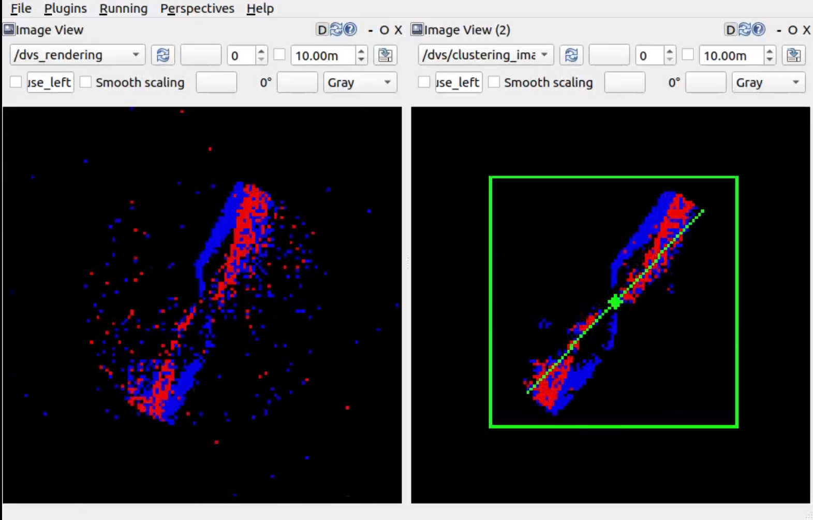

# eDVS转速测量

## 简介说明

该代码基于Ubuntu20.04 ROS（Noetic）下开发的算法包（该版本下的驱动已更新，解决Melodic中boost函数）。包含eDVS驱动包（dvs_ros_driver，基于libcaer的eDVS驱动程序）、渲染器（dvs_renderer，该包来源于[rpg_dvs_ros](https://github.com/uzh-rpg/rpg_dvs_ros)）、转速测量包（clustering）。

---

## 安装说明

1. 安装libcaer库

   libcaer是事件相机C++驱动库，可支持设备有DVS128、eDVS、DAVIS。可以使用apt直接自动安装，也可以手动安装(参考[libcaer](https://github.com/inivation/libcaer))。

   在Ubuntu20.04中安装：

   ~~~sh
   $ sudo add-apt-repository ppa:inivation-ppa/inivation
   $ sudo apt-get update
   $ sudo apt-get install libcaer-dev 
   ~~~

   当为Ubuntu18.04时，则添加另外的源

   ~~~sh
   $ sudo add-apt-repository ppa:ubuntu-toolchain-r/test
   $ sudo add-apt-repository ppa:inivation-ppa/inivation-bionic
   $ sudo apt-get update
   $ sudo apt-get install libcaer-dev
   ~~~

   此时可应用libcaer/example中eDVS例子进行读取。DVS插入电脑USB，默认串口号为`/dev/ttyUSB0`，需要串口权限，通过修改udev规则即可。

   编辑文件:

   ```shell
   $ sudo gedit /etc/udev/rules.d/70-snap.core.rules  #或者sudo gedit /etc/udev/rules.d/70-ttyusb.rules
   ```

   增加一行：

   ```shell
   KERNEL=="ttyUSB[0-9]*", MODE="0666"
   ```

2. 安装edvs_detect_rev

   创建工作空间

   ~~~shell
   $ mkdir -p ~/catkin_ws/src
   $ cd catkin_ws/src/
   ~~~

   克隆catkin_simple、edvs_detect_rev

   ~~~shell
   $ git clone https://github.com/catkin/catkin_simple.git
   $ git clone https://github.com/Xujianhong123Allen/edvs_detect_rev.git
   ~~~

   进行安装

   ~~~shell
   $ sudo apt-get install python3-catkin-tools python3-osrf-pycommon 
   $ cd ~/catkin_ws
   $ catkin build
   ~~~

---
## 运行实例

- 打开eDVS设备，并检测电机转速

  ~~~shell
  $ source devel/setup.bash
  $ roslaunch dvs_renderer dvs_mono.launch
  $ rosrun clustering clustering   #检测转速
  ~~~

- 运行结果截图如下：

  
  
  [视频演示](https://www.bilibili.com/video/bv1y3411q7dT)，其中视频中为60-480r/min。


